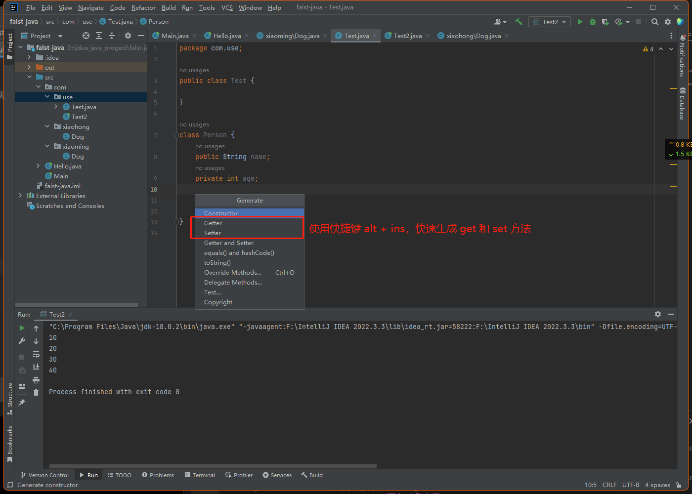

# 面向对象中级

## 包

### 包的三大作用

- **区分相同名字的类**
- **控制访问范围**
- **当类很多时,可以很好的管理类**

### 包的基本语法

**package com.haspedu;**
1. **package** 关键字， 表示打包
2. **com.hspedu** 表示报名

### 包的本质分析（原理）

包的本质 实际上就是创建不同的文件夹来保存类文件

### 演示
```java
// 第一个包文件 包名称为 com.xiaoming
package com.xiaoming;

public class Dog {
    System.out.println("我是第一个包，类名为 Dog");
}
```
```java
// 第二个包文件 包名称为 com.xiaohong
package com.xiaohong;

public class Dog {
    System.out.println("我是第二个包，类名为 Dog");
}
```
```java
// 第三个包文件 包名称为 com.use
// 使用上面两个包
package com.use;

import com.xiaoming.Dog;
// import com.xiaoming.*; * 表示导入com.cioaming 包下的所有类

public class Test {
/**
 * 等价于 com.xiaohong.Dog d1 = new com.xiaohong.Dog();
 * 默认省略
 */
   Dog d1 = new Dog(); 
/**
 * com.xiaohong 就是为了区分不同包的相同类名
 */
   com.xiaohong.Dog d2 = new com.xiaohong.Dog();
}
```
### 包的命名

#### 包的命名规则
**只能包含数字、字母、下划线、小圆点.,但不能用数字开头，不能是关键字或保留字**

#### 包的命名规范
- **一般是小写字母 + 小圆点一般是**
- **com .公司名 .项目名 .业务模块名**

### Java 常用的包
- java.lang  ：lang 包是基本包，默认引入，不需要再引入.
- java.util ：util 包，系统提供的工具包，工具类，使用 Scanner
- java.net ：网络包，网络开发
- java.awt ：是做 java 界面开发，GUI 

### 使用系统包 对数组排序
```java
package com.use;

import com.xiaoming.Dog;

import java.util.Arrays;

public class Test {
   Dog d1 = new Dog();
   com.xiaohong.Dog d2 = new com.xiaohong.Dog();
   public static void main(String[] args){
      int[] arr = {-1, -8, 10, 1, 8};
      Arrays.sort(arr); // 系统包中的方法
      for (int i = 0; i < arr.length; i++){
         System.out.println(arr[i]);
      }
   }
}
```

### 注意事项和使用细节

1. **package** 的作用是声明当前类所在的包，需要放在类的最上面，一个类中最多只有一句package
2. **import**指令 位置放在**package**的下面，在类定义前面,可以有多句且没有顺序要求。

## 访问修饰符

### 介绍
java 提供四种访问控制修饰符号，用于控制方法和属性( 成员变量 ) 的访问权限( 范围 )
:::tip 修饰符号：
1. **公开级别：** 用 **public** 修饰,对外公开
2. **受保护级别：** 用 **protected** 修饰,对子类和同一个包中的类公开
3. **默认级别：** 没有修饰符号,向同一个包的类公开
4. **私有级别：** 用 **private** 修饰,只有类本身可以访问,不对外公开

 **演示**
 ```java
 public class Test {
   int n3 = 30;
   public int n1 = 10;
   protected int n2 = 20;
   private int n4 =40;

   public void setN1() {
      // 同类中 访问四个属性
      System.out.println(this.n1);
      System.out.println(this.n2);
      System.out.println(this.n3);
      System.out.println(this.n4);
   }
}
 ```
:::

## 面向对象的三大特征（封装，继承，多态）

### 封装
#### 介绍
封装 **(encapsulation)** 就是把抽象出的数据 **[属性]** 和对数据的操作 **[方法]** 封装在一起,数据被保护在内部,程序的其它部分只有通过被授权的操作 **[方法]**,才能对数据进行操作。

#### 封装的理解和好处
1. 隐藏实现细节： 方法( 连接数据库 ) <-- 调用( 传入参数...)
2. 可以对数据进行验证，保证安全合理

#### 封装的实现步骤
1. 将属性进行私有化 **private** ( 不能直接修改属性 )
2. 提供一个 set 方法， 用于对属性判断并赋值
3. 提供一个公共的get方法，用于获取属性的值

#### 演示
:::tip  不能随便查看人的年龄,工资等隐私并对设置的年龄进行合理的验证。年龄合理就设置，否则给默认,年龄必须在 1-120,年龄，工资不能直接查看， name 的长度在 2-6 之间
```java
public class Test {
    public static void main(String[] args){
       Person p1 = new Person();
       p1.setName("杨胜军");
       p1.setAge(27);

       /** 调用构造器 */
        Person p = new Person("杨胜军", 10);
        System.out.println(p.info());
    }
}

class Person {
    public String name;
    private int age;

    /** 使用构造器 调用 set 方法 */
    public Person(String name, int age){
        setName(name);
        setAge(age);
    }

    /** get 方法 */
    public String getName() {
        return name;
    }
    public int getAge() {
        return age;
    }

    /** set 方法 */
    public void setName(String name) {
        this.name = name;
    }
    public void setAge(int age) {
        this.age = age;
    }
    /** 输出信息 */
    public void info(){
        System.out.println("name=" + this.name + "age" + this.age);
    }
}

```
快速生成 get 和 set

:::

### 继承
**提出代码复用的问题**
- **问题：** 我们编写了两个类，一个是 Pupil 类，一个是 Graduate 问题 : 两个类的属性和方法有很多是相同的，怎么办?

#### 介绍
>继承可以解决代码复用,让我们的编程更加靠近人类思维.当多个类存在相同的属性(变量)和方法时,可以从这些类中抽象出父类,在父类中定义这些相同的属性和方法，所有的子类不需要重新定义这些属性和方法，只需要通过extends来声明继承父类即可。
:::tip Pupil 类
```java
public class Pupil {
    public String name;
    public int age;
    private double score;

    public void setScore(double score) {
        this.score = score;
    }
    public void testInfo() {
        System.out.println("小学生" + name + "年龄" + age + "成绩" + score);
    }
}
```
:::
::: tip Greaduate 类
```java
public class Greaduate {
    public String name;
    public int age;
    private double score;
  
    public void setScore(double score) {
        this.score = score;
    }
    public void testInfo() {
        System.out.println("大学生" + name + "年龄" + age + "成绩" + score);
    }
}
```
:::
::: tip Test2 类 中调用 上面两个类
```java 
public class Test2 {
    public static void main(String[] args){
        Pupil pupil = new Pupil();
        pupil.name = "小明";
        pupil.age = 10;
        pupil.setScore(60);
        pupil.testInfo();
        Greaduate greaduate = new Greaduate();
        greaduate.name = "大学生";
        greaduate.age = 22;
        greaduate.setScore(70);
        greaduate.testInfo();
```
:::
:::tip
```java

```
:::
- 示意图


#### 基本语法
```java
class 子类 extends 父类 {

}
1. 子类就会自动拥有父类定义的属性和方法
2. 父类又叫 超类，基类。
3. 子类又叫派生类。
```
