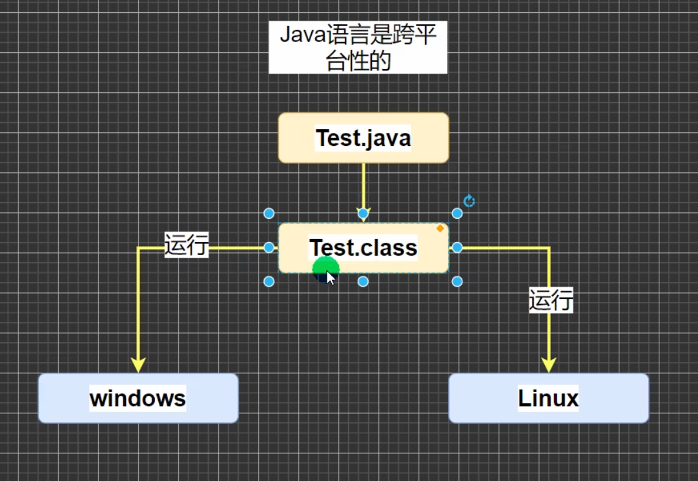
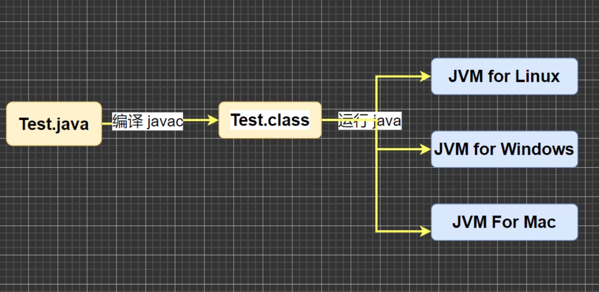

## java特性

1.java语言是面向对象的（oop）

3.跨平台性（一个便衣好的 .class 文件可以在多个系统下运行，中特性叫跨平台性）

4.java语言是解释性语言

​	解释性语言：javascript，PHP，java

​	编译性语言：c、c++

## 开发软件

editplus、notepad++、Sublime Text、IDEA、eclipse

## java运行机制及运行过程

### 机制：java核心机制-java 虚拟机 [ JVM （java virtual machine） ]

### 运行过程：

​	1.JVM是一个虚拟的计算机，具有指令集并使用不同的存储区域，负责执行指令，管理数据、内存、寄存器，包含JDK中。

​	2.对于不同的平台，有不同的虚拟机

​	3.java虚拟机机制屏蔽了底层运行平台的差别，实现了“一次编译，到处运行”（如图）

## 什么是JDK、JRE

### JDK

​	1.JDK全称（java Development Kit   Java开发工具包）
​	   JDK = JRE + java的开发工具 [ java、javac、javadoc、javap等 ]

​	 2.JDK是提供给开发人员使用的，其中包含了java的开发工具，也包括了JRE。所以		安装了JDK，就不用单独安装JRE了

### JRE

​		1.JRE（Java Runtime Environment     Java运行环境）

​			JRE = JVM + Java的核心类库[ 类 ]

​		2.包括java虚拟机（JVM Java Virtual Machine）和Java程序所需的核心类库等，			如果只运行 Java 程序，计算机安装JRE即可

### JDK、JRE和JVM的关系

​	1.JDK = JRE + 开发工具集（例如：javac、java编译工具等）

​	2.JRE = JVM + java SE标准类库

​	3.JDK = JVM + java SE标准类库 + 开发工具集

​	4.只运行开发好的 .class 文件 只需要JRE

