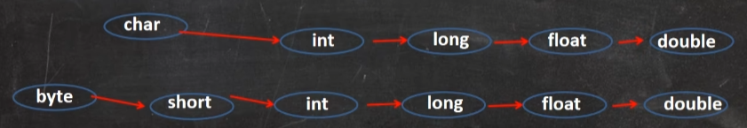

# 基本数据类型转换

## 自动类型转换

### 	介绍:

​      当iava程序在进行赋值或者运算时，精度小的类型自动转换为精度大的数据类型这个就是自动类型转换。

​      数据类型按精度(容量)大小排序为(背，规则)



```java
public class AutoConvert {
    public static void main(String[] args) {
        int num = 'a'; //ok char -> int
        double d1 = 80; //ok int -> doublre
    	System.out.println(num); //97
    	System.out.printIn(d1); //80.0
      }
 }
```

### 自动类型转换注意和细节

​	1.有多种类型的数据混合运算时，系统首先自动将所有数据转换成容量最大的那种数据类型，然后再进行计算
```java
        int n1 = 10; //ok
        
        //错误 n1 + 1.1 => 结果类型是 double
        float d1 = n1 + 1.1; 
        
        //对 n1 + 1.1 => 结果类型是 doubledouble
        double d1 = n1 + 1.1; 
        
        //对 n1 + 1.1 => 结果类型是 float
        float d1 = n1 + 1.1F; 
```


​	2.当我们把精度(容量)大 的数据类型赋值给精度(容量)小 的数据类型时，就会报错，反之就会进行自动类型转换
```java
         //错误 double -> int
         int n2 = 1.1;
```

​	3.**(byte,short)** 和 **char** 之间不会相互自动转换
```java
       /** 
        * 当把具体数赋给 byte 时，(1)先判断该数是否在byte范围内，如果是就可以
        */
        
        //对  -128-127
        byte b1 = 10; 
        
        // int n2 = 1; //n2 是int
        // byte b2 = n2; //错误，原因 : 如果是变量赋值，判断类型
        
        //错误， 原因 byte 不能自动转成 char
         char c1 = b1; 
```

​	4.byte，short，char 他们三者可以计算，在计算时首先转换为 int 类型

​	5.boolean 不参与转换

​	6.自动提升原则: 表达式结果的类型自动提升为 操作数中最大的类型

