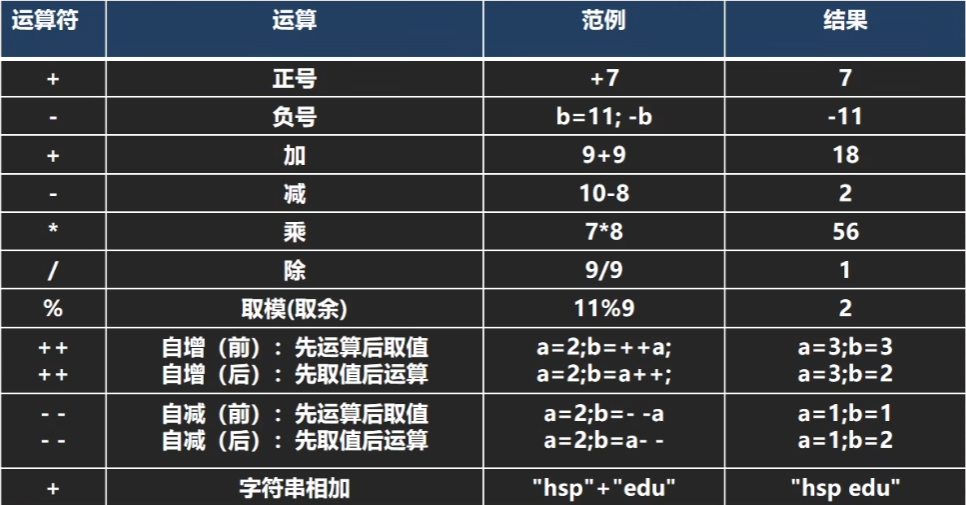
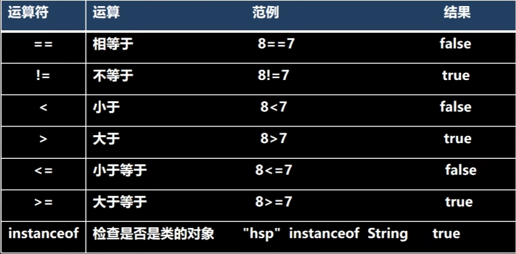

# 运算符
:::tip 运算符介绍
   > 运算符是一种**特殊的符号**，用以表示数据的运算、赋值和比较等
   >
   > 1. **算术运算符**
   > 2. **赋值运算符**
   > 3. **关系运算符 [比较运算符]**
   > 4. **逻辑运算符**
   > 5. **位运算符 [需要二进制基础]**
   > 6. **三元运算符**
:::
## 算数运算符

### 介绍:

算术运算符是对数值类型的变量进行运算的，在Java程序中使用的非常多

### 概览


### 演示

1. 基本使用

   ```java
   System.out.println(10 / 4); // 输出 2
   System.out.println(10.0 / 4); // 输出 2.5
   double d = 10 / 4; // 10/4 = 2 所以 double 型为 2.0 
   System.out.println(d); // 输出 2.0
   ```

2.  取模（取余：%）

   ```java
   /**
    * 公式：a % b = a - a / b * b;
    * 例如：
    * -10 % 3 => -10 - (-10) / 3 * 3 = -10 + 9 = -1
    * 10 % - 3 = 10 - 10 / (-3) = 10 - 9 = 1
    */
   System.out.println(10 % 3);
   System.out.println(-10 % 3);
   System.out.println(10 % -3);
   System.out.println(-10 % -3);
   ```

3.  ++ 的使用（前++，后++）

   ```java
   int i = 10;
   i++;
   ++i;
   System.out.println(i); // 12
   /**
    * 前++：++i 先自增后赋值
    * 后++：i++ 先赋值后自增
   ```

## 关系运算符

### 介绍

1. 关系运算符的结果都是 **boolean** 型，也就是要么是 **true**，要么是 **false**
2. 关系表达式 经常用在 if结构的条件中或循环结构的条件中

### 概览



