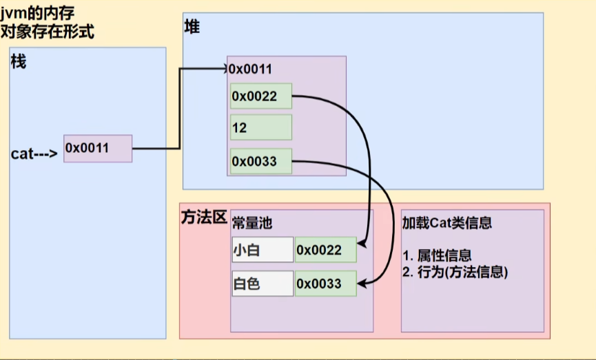
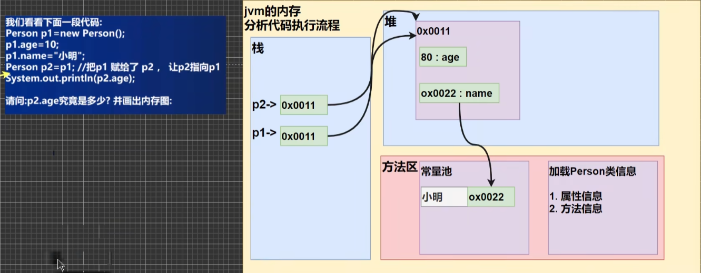

# 面向对象编程

## 类与对象(OOP)

### 案例

:::tip 张老太养了两只猫猫: 一只名字叫小白,今年3岁，白色。还有一只叫小花,今年100岁,花色。请编写一个程序，当用户输入小猫的名字时就显示该猫的名字，年龄，颜色。
>如果用户输入的小猫名 错误.则显示 张老太没有这只猫猫。
:::
```java
// 定义一个类
class Cat {
    String name; // 名字
    int age; // 年龄
    String color; // 颜色
}

// 使用OOP面向对象解决
// 实例化一直猫[ 创建一只猫 ]
// 1.new Cat() 创建一只猫
// 2.Cat cat1 = new Cat(); 把创建的猫赋给 cat1
// 3.cat1 就是一个对象
// 4.访问 cat1 中的属性 cat1.name
Cat cat1 = new Cat();
cat1.name = "姓名";
cat1.age = 13;
cat1.color = 'red';
Sytem.out.println(cat1.nam + cat1.age + cat1.color)

```
### 对象在内存中的分布示意图


### 属性 / 成员变量

#### 介绍

1. 从概念或叫法上看: 成员变量 = 属性 = field (即 成员变量是用来表示属性
   的，授课中，统一叫 属性)

2. 属性是类的一个组成部分，一般是**基本数据类型**,也可是**引用类型**(对象，数组)
   比如我们前面定义猫类 的 int age 就是属性
```java
class Car {
    String name;
    double price;
    String color;
    String[] master;
}
```
#### 注意事项和细节说明
1. 属性的定义语法同变量，示例: 访问修饰符 属性类型 属性名：简单介绍访问修饰符: 
控制属性的访问范围有四种访问修饰符 public, proctected, 默认, private
2. 属性的定义类型可以为任意类型，包含基本类型或引用类型
3. 属性如果不赋值，有默认值，规则和数组一致
 ```java
 /**
  * 1.创建 Person 对象
  * 2.p1 是对象名（对象引用）
  * 3.new Person() 创建对象空间（数据）
  * 对象属性的默认值，遵守规则：int 0, byte 0 ···
  */
  Person p1 = new Person();
  class Person {
    int age;
    String name;
    double sal;
    boolean isPass;
  }
 ```
### 如何创建对象
1. 先声明在创建
    ```java
    Cat cat; // 声明对象
    cat = new Cat(); // 创建对象
    ```
2. 直接创建
    ```java
    Cat cat = new Cat();
    ```
### 类和对象的分配机制

### 对象的创建过程
```java
Person p = new Person();
p.name = "jack";
p.age = 10;
```
1. 先加载 **Person** 类信息(属性和方法信息,只会加载一次)
2. 在堆中分配空间,进行默认初始化(看规则)
3. 把地址赋给 p，p 就指向对象
4. 进行指定初始化，比如 p.name = "jac" p.age =10
## 成员方法

## 成员方法机制

## 重载

## 可变参数

## 作用域

## 构造器

## this